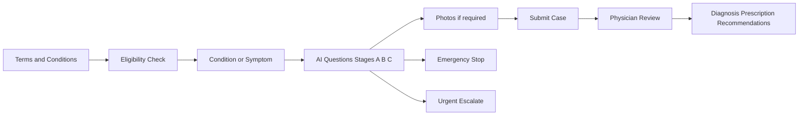
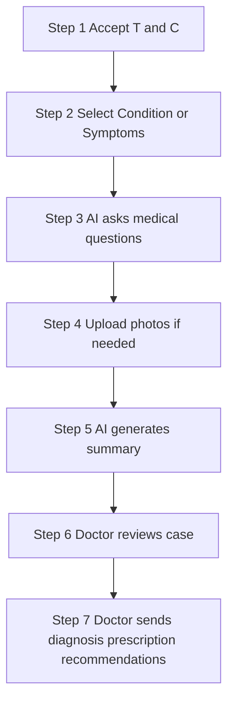

# TeleUrgentCare / EasyConsult Platform — Patient Journey and Process Flow

## 1. Project Scope

**In scope**

- **Patient journey:** Steps, screens, decisions, and outcomes from first touch to physician response.
- **Process flow:** Intake stages, safety checks (red-flag engine), disposition types, and physician workflow as flow only.
- High-level disposition and patient-facing messaging (e.g. emergency stop, urgent review).

**Out of scope**

- Backend systems, APIs, databases, authentication, and infrastructure.

---

## 2. Platform Overview

The platform is an **asynchronous telemedicine system** used in the United States (similar to EasyConsult, K Health, Teladoc async). The patient submits structured medical information online without phone or video. A licensed physician reviews the case later (typical response within 2 hours). The **AI acts only as an intake assistant**: it asks questions, collects information, runs safety checks, and produces a physician-ready summary. The **physician makes all clinical decisions** (diagnosis, treatment, prescription). The AI does not diagnose or suggest treatment to the patient.

---

## 3. Patient Journey

### Start

- Patient accepts **Terms and Conditions** and confirms understanding that this is not emergency care and that care is asynchronous (no live phone or video).
- **Eligibility:** Age 18+, physically located in a state where the provider is licensed. If not met, the consultation cannot proceed.

### Entry mode

The patient chooses one of two paths:

| Path | Description |
|------|-------------|
| **Condition-based** | Patient selects a condition they believe they have (e.g. UTI, pink eye, yeast infection, acne). The system shows a short description and possible treatments, then the AI asks condition-specific questions. |
| **Symptom-based** | Patient selects one or more symptoms (e.g. cough, headache, rash, nausea). The AI asks follow-up questions based on the selected symptoms. |

### Intake (question flow)

Questions are asked in a structured order:

1. **Universal intake:** Demographics (age, sex, state), medical history (conditions, medications, allergies, surgeries), pregnancy status, social factors (smoking, alcohol, drug use), prior treatment, recurrence, travel.
2. **Safety screen (Stage A):** Universal danger screen *before* symptom/condition questions (e.g. severe chest pain, trouble breathing, stroke-like symptoms, severe bleeding, suicidal thoughts). Any “yes” triggers an immediate stop.
3. **Primary clinical block:** Main complaint logic based on selected condition or symptoms.
4. **Associated symptom blocks:** Only when relevant to the chief complaint.
5. **Modifier blocks:** Pregnancy, STI exposure, chronic illness, travel, medication refill, mental health safety, photo upload when required.
6. **Safety block (Stage C):** Final safety scan before submission. Red-flag rules run again (e.g. “worst headache of life,” cannot keep fluids down, throat swelling). If triggered, the patient cannot proceed to normal submission.

**Stage B** runs throughout: real-time stop/escalate logic during the question flow (e.g. stop if new red flag, escalate to urgent same-day review when appropriate).

### Photos

For certain conditions (e.g. skin rash, acne, eye infections, cold sores, shingles), **photo upload is required**. The system typically requires 2–3 photos (good lighting, close-up and wider view). The consultation cannot proceed without required photos.

### Outcomes

| Outcome | What happens |
|--------|----------------|
| **Emergency stop** | System shows: *“Your symptoms may indicate a medical emergency. This platform cannot safely manage this condition. Please go to the nearest emergency room or call emergency services immediately.”* Consultation stops. |
| **Urgent / same-day** | Case is marked for urgent physician review or in-person care recommended. Patient is informed as appropriate. |
| **Routine** | Case is submitted. AI generates a physician-ready summary (chief complaint, duration, symptoms, relevant positives/negatives, red flags checked/denied, medical history, suggested differentials/treatments/tests for physician only). **No diagnosis or treatment is shown to the patient.** |

### After submission

Patient waits for physician review. The physician reviews the summary, confirms or changes assessment, and may approve treatment, send a prescription, or send recommendations. The patient receives the **physician’s** diagnosis, prescription (if any), and recommendations. The AI does not give diagnosis or treatment advice to the patient.

---

### Patient journey (diagram)

---

## 4. Process Flow (No Backend)

### High-level 7 steps

1. User agrees to Terms and Conditions.
2. User selects **Condition** or **Symptoms**.
3. AI asks medical questions (universal → symptom/condition blocks → modifiers; safety at Stages A, B, C).
4. User uploads photos if required.
5. AI generates medical summary (for physician only).
6. Doctor reviews case.
7. Doctor sends diagnosis, prescription (if applicable), and/or recommendations.

### Decision engine layers (order only)

| Layer | Description |
|-------|-------------|
| 1 | Universal intake (demographics, history, safety screen) |
| 2 | Entry mode (symptom vs condition) |
| 3 | Primary clinical block (main complaint) |
| 4 | Associated symptom blocks (when relevant) |
| 5 | Modifier blocks (pregnancy, travel, STI, refill, mental health, photo) |
| 6 | Safety block (final scan before submit) |

### Disposition types (flow only)

- **Routine async** — Normal asynchronous physician review.
- **Urgent same-day physician review** — Prioritized for same-day review.
- **In-person care advised** — Patient directed to in-person care.
- **Emergency stop** — Consultation stopped; patient directed to ER/emergency services.

### Physician side (workflow only)

**Queues:** New | Urgent | Awaiting clarification | Ready for prescribing | Completed | Escalated.

**Case view:** Patient header, symptom/condition selected, AI summary, answers timeline, photo gallery, red-flag review, AI suggestions (differentials/treatments/tests), physician note editor, SOAP draft, prescription panel, patient message panel.

**Actions:** Approve | Edit | Request more info | Prescribe | Send advice only | Recommend urgent care | Send ER message | Close case.

*(No backend or schema details; workflow only. Source: TeleUrgentCare_Physician_Dashboard_Action_Status_Schema.xlsx.)*

---

### Process flow (diagram)

---

## 5. Safety and AI Role (Flow-Relevant Only)

### Red-flag behavior

- Red flags are evaluated in **three stages:** Stage A (before symptom/condition questions), Stage B (during question flow), Stage C (before submission).
- If a red flag is triggered: consultation **stops** or is **escalated** (urgent same-day or in-person advised). The patient never receives a diagnosis or treatment from the AI.

**Examples of hard stop (emergency):** Severe chest pain, difficulty breathing, stroke-like symptoms (facial droop, weakness, trouble speaking), loss of consciousness, severe bleeding, vomiting/coughing blood, severe abdominal pain, severe allergic reaction (tongue/throat swelling), suicidal thoughts or thoughts of harming others, severe head injury, sudden paralysis, seizure, confusion or altered mental status, inability to swallow saliva, vision loss, severe eye pain, testicular torsion-like symptoms, heavy vaginal bleeding with dizziness, pregnancy with severe abdominal/pelvic pain or heavy bleeding.

**Emergency message to patient:** *“Your symptoms may indicate a medical emergency. This platform cannot safely manage this condition. Please go to the nearest emergency room or call emergency services immediately.”*

### AI role

- **Does:** Asks questions, collects structured history, detects danger early, stops or escalates when unsafe, requires photos when needed, creates a structured physician-ready summary (and internal clinical suggestions for the doctor only).
- **Does not:** Diagnose the patient, give treatment advice to the patient, or act as the doctor. The physician always makes the final decision.

---

## 6. Source Documents

| Document | Role for patient journey and process flow |
|----------|-------------------------------------------|
| **TUC + EASYCONSULT ALL-IN-0NE PLATFORM.pdf** | Full triage rules, decision engine layers 1–6, red-flag engine (Stages A/B/C), question blocks, physician dashboard flow, SOAP summary, disposition types. |
| **TUC + EASYCONSULT ALL-IN-0NE PLATFORM (1).pdf** | Simple 7-step platform flow, two entry modes (condition vs symptom), AI role, emergency message, photo requirements, prescription limitations. |
| **teleurgent_ai_question_bank (1).xlsx** | Question bank used along the patient journey (questions and logic). |
| **TeleUrgentCare_AI_Triage_Import_Pack.xlsx** | Triage/import pack; source for triage rules and questions. |
| **TeleUrgentCare_Physician_Dashboard_Action_Status_Schema.xlsx** | Physician dashboard action and status definitions; source for physician-side process flow (queues, case view, actions). |

---

*This README describes only the patient journey and process flow. Backend implementation is out of scope.*
